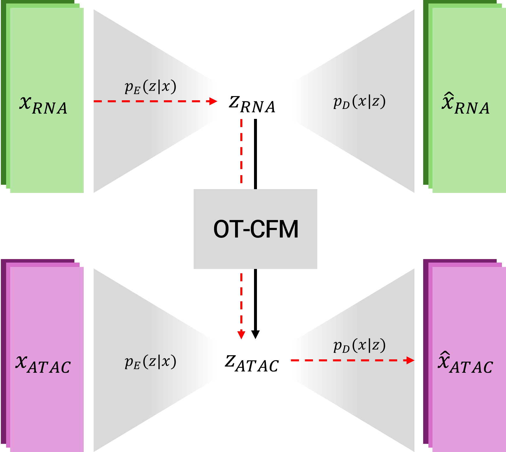
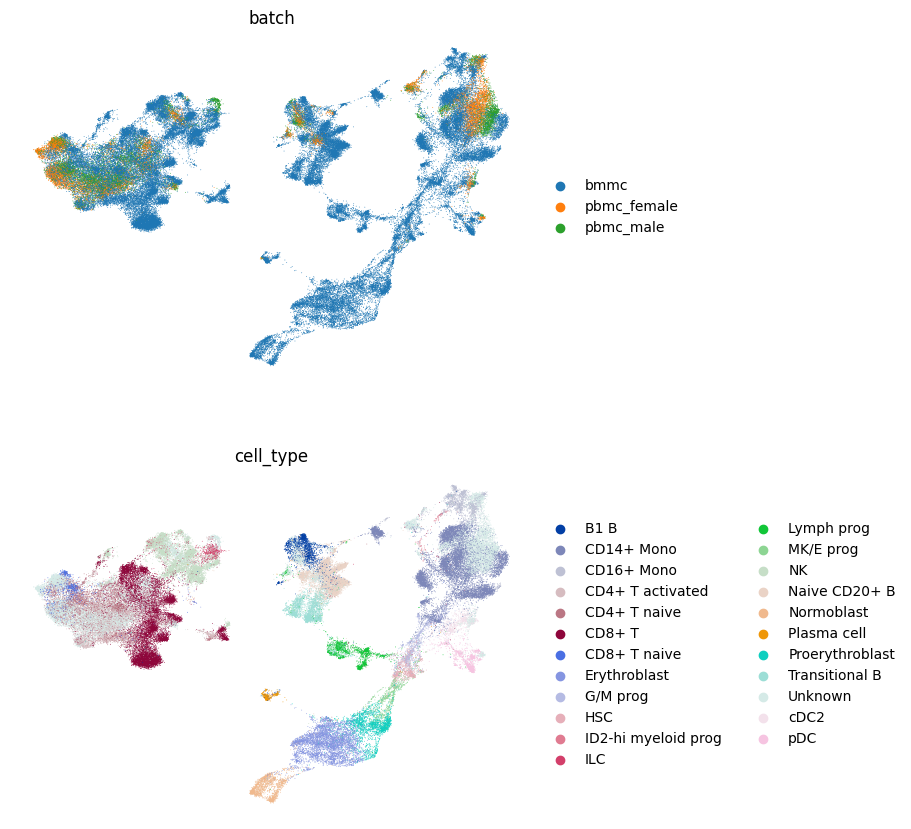
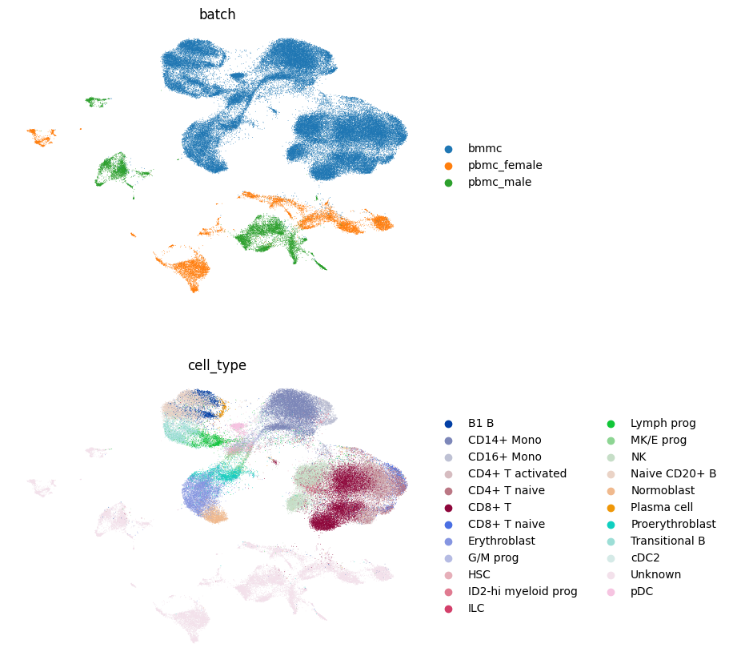
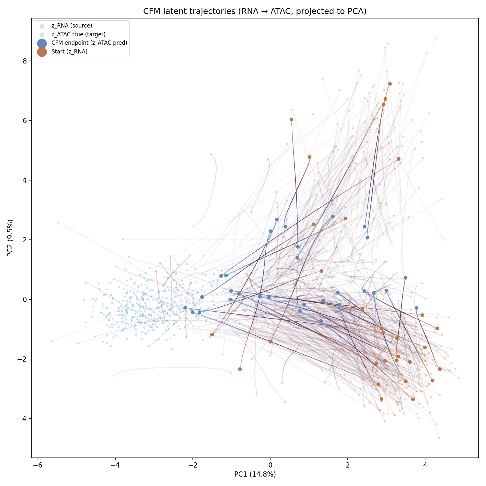

# Cross-Modal Single-Cell Data Generation via Conditional Flow Matching


<p style="text-align: justify;">Single-cell sequencing has revolutionized the field of biology and biomedicine, allowing for the study of cells at an unprecedented resolution. More recently, further advances have made it possible to measure several modalities such as gene expression and chromatin accessibility simultaneously for a single cell. This has led to the curation of extensive paired multi-modal datasets. However, where such paired data is unavailable, it is of paramount interest to generate missing modalities from existing ones. The conversion of scRNA-seq into scATAC-seq data is of particular interest due to the abundance of the former and scarcity of the latter modality. In recent years several tools have been proposed to tackle precisely this task, integrating and converting modalities to moderate practical success. We propose here an approach centered around Conditional Flow Matching, a flow-based generative approach that learns a continuous vector field mapping between a source and target distribution via optimal transport. To the best of our knowledge, this is the first application of OT-CFM specifically to the RNA-to-ATAC modality transfer. Two independently trained VAEs compress each modality to a shared latent dimensionality, which the flow matching model then bridges. For training we make use of three integrated datasets covering over 90k paired gene expression and ATAC profiles from human blood cells. Our results demonstrate robust RNA compression and reconstruction (R^2=0.996), but substantially weaker ATAC reconstruction (AUPRC=0.26), with synthetic ATAC profiles remaining fully distinguishable from real data (classifier AUC=1.0). By extension, the flow matching, although converging nicely to a solution and showing clear signs of learning the correct direction of flow, was unable to synthesize ATAC data indistinguishable from real data. The results highlight the sparsity of ATAC data and misalignment of independently trained latent spaces as key hurdles for modality transfer. Overall, with adjustments to data preprocessing, training objectives and latent space learning, flow matching remains a promising and interesting direction for single-cell modality transfer.</p>

## Contributors

This project is the final project of the "Generative Neural Networks" lecture at Heidelberg University, which took place in the winter semester of 2025-2026.

**Members**:
- Aidana Smagulova (Molecular Biosciences)
- Forrest Hyde (Molecular Biosciences)
- Niklas Schmidt (Molecular Biotechnology)

## Our Approach

<p style="text-align: justify;">We frame RNA-to-ATAC modality transfer as a distribution mapping problem in a compressed latent space. Two modality-specific infoVAEs are trained independently to compress high-dimensional scRNA-seq (30,000 HVGs) and scATAC-seq (30,000 peaks) data into a shared 128-dimensional latent space. Once trained, their weights are frozen and an Optimal Transport Conditional Flow Matching (OT-CFM) model is trained to learn the vector field mapping from the RNA latent distribution to the ATAC latent distribution. At inference, a gene expression profile is passed through the RNA encoder, the CFM model integrates the learned ODE to produce a predicted ATAC latent point, and the ATAC decoder reconstructs the full chromatin accessibility profile. The model architecture is shown below. The dotted red line indicates the path of inference.</p>

<p align="center">
  
</p>

---

## Data

Training used three paired scRNA-seq / scATAC-seq datasets from human blood cells, integrated using scVI and peakVI:

| Dataset | Cells | Source |
|---|---|---|
| BMMC (12 donors) | 69k | GEO: GSE194122 |
| PBMC male donor | ~11k | 10X Genomics |
| PBMC female donor | ~12k | 10X Genomics |

The BMMC dataset can be accessed from the [NCBI Gene Expression Omnibus](https://www.ncbi.nlm.nih.gov/geo/) under accession number **GSE194122**. The PBMC datasets are available from the [10X Genomics website](https://www.10xgenomics.com/datasets): search *"10k Human PBMCs, Multiome v1.0, Chromium X"* for the male donor, and *"PBMC from a Healthy Donor - Granulocytes Removed Through Cell Sorting (10k)"* for the female donor. The batch integrated datasets are depicted below: (left) RNA, (right) ATAC. PBMC dataset lack cell type annotations.

<p float="left">
  
   
</p>

---

## Final Results

<p style="text-align: justify;">The RNA-VAE achieved strong reconstruction performance (R^2=0.996, mean Pearson R=0.55 per cell), confirming that the compression pipeline works well for continuous gene expression data. The ATAC-VAE struggled considerably due to the sparse, binary nature of chromatin accessibility data, recovering only 29–33% of open chromatin regions (AUPRC=0.26). The OT-CFM model learned the correct direction of flow between latent spaces (see below) but was unable to fully bridge the gap between the independently trained modality manifolds. Downstream evaluation — including KS tests, UMAP embeddings, cross-correlation analysis and a Random Forest classifier (AUC=1.0) — confirmed that synthetic ATAC profiles still remain clearly distinguishable from real data. The results highlight independent latent space training and ATAC data sparsity as the primary bottlenecks.</p>

<p align="center">
  
</p>

---

### Environment Setup

Create and activate the conda environment from the requirements file:
```bash
conda env create --file requirements.txt --name 
conda activate 
```

### Running the Pipeline

Training and evaluation are handled by separate scripts for each model component. Configuration variables (paths, hyperparameters, run names) are set at the top of each script.

**Step 1 — Train and evaluate the VAEs:**
```bash
python src/train_rna.py
python src/train_atac.py
python src/test_rna.py
python src/test_atac.py
```

**Step 2 — Train and evaluate the CFM model:**
```bash
python src/train_cfm.py
python src/test_cfm.py
```

All outputs are saved to `./runs`. Results are written to `results/{run}/final_results/` and logs to `logs/{run}/`.

---

### Folder Structure

```
main/
├── data/
│   └── preprocessed data
│        └── bmmc_celltype_split
│        └── bmmc_uniform_split
│        └── integrated_celltype_split
│        └── integrated_uniform_split
├── figures/                 # README figures
├── logs/                    # workflow logs
├── runs/                    # workflow results
├── src/                     # python scripts
│   └── utils/               # data loading and logging utilities
│   └── models/              # model definitions (infoVAE, CFM)
│   └── train_rna.py         # RNA-VAE training
│   └── train_atac.py        # ATAC-VAE training
│   └── train_cfm.py         # CFM training
│   └── test_rna.py          # RNA-VAE evaluation
│   └── test_atac.py         # ATAC-VAE evaluation
│   └── test_cfm.py          # end-to-end CFM evaluation
├── .gitignore
├── requirements.txt         # conda environment specification
└── README.md                # you are here
```


## References

1. Tong A, Fatras K, Malkin N, Huguet G, Zhang Y, Rector-Brooks J, Wolf G, Bengio Y. [Improving and generalizing flow-based generative models with minibatch optimal transport.](https://arxiv.org/abs/2302.00482) *arXiv preprint arXiv:2302.00482*, 2023.

2. Zhao S, Song J, Ermon S. [InfoVAE: Information maximizing variational autoencoders.](https://arxiv.org/abs/1706.02262) *arXiv preprint arXiv:1706.02262*, 2017.

3. Cao Y, Zhao X, Tang S, Jiang Q, Li S, Li S, Chen S. [scButterfly: a versatile single-cell cross-modality translation method via dual-aligned variational autoencoders.](https://www.nature.com/articles/s41467-024-46457-w) *Nature Communications*, 15(1):2973, 2024.

4. Wu KE, Yost KE, Chang HY, Zou J. [BABEL enables cross-modality translation between multiomic profiles at single-cell resolution.](https://www.pnas.org/doi/10.1073/pnas.2023070118) *Proceedings of the National Academy of Sciences*, 118(15):e2023070118, 2021.

5. Gayoso A, Lopez R, Xing G, Boyeau P, Valiollah Pour Amiri V, Hong J, Wu K, Jayasuriya M, Mehlman E, Langevin M, Liu Y, Samaran J, Misrachi G, Nazaret A, Clivio O, Xu C, Ashuach T, Gabitto M, Lotfollahi M, Svensson V, da Veiga Beltrame E, Kleshchevnikov V, Talavera-López C, Pachter L, Theis FJ, Streets A, Jordan MI, Regier J, Yosef N. [A Python library for probabilistic analysis of single-cell omics data.](https://www.nature.com/articles/s41587-021-01206-w) *Nature Biotechnology*, 40:163–166, 2022.

6. Lance C, Luecken MD, Burkhardt DB, et al. [Multimodal single cell data integration challenge: results and lessons learned.](https://www.biorxiv.org/content/10.1101/2022.04.11.487796) *BioRxiv*, 2022.

7. Luecken MD, Burkhardt DB, Cannoodt R, et al. [A sandbox for prediction and integration of DNA, RNA, and proteins in single cells.](https://openreview.net/forum?id=gN35BGa1Rt) *NeurIPS Datasets and Benchmarks Track*, 2021.

8. Lin T-Y, Goyal P, Girshick R, He K, Dollár P. [Focal loss for dense object detection.](https://arxiv.org/abs/1708.02002) *IEEE Transactions on Pattern Analysis and Machine Intelligence*, 42(2):318–327, 2020.

9. Wolf FA, Angerer P, Theis FJ. [SCANPY: large-scale single-cell gene expression data analysis.](https://genomebiology.biomedcentral.com/articles/10.1186/s13059-017-1382-0) *Genome Biology*, 19(1):15, 2018.

10. Virshup I, Bredikhin D, Heumos L, et al. [The scverse project provides a computational ecosystem for single-cell omics data analysis.](https://www.nature.com/articles/s41587-023-01733-8) *Nature Biotechnology*, 41(5):604–606, 2023.